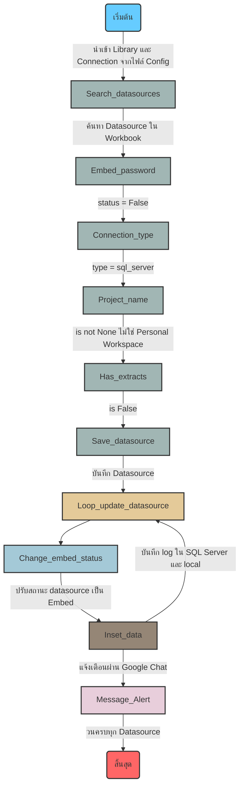

# Change Datasource Embed Status

```mermaid
graph TD;
    Start(เริ่มต้น) -->|นำเข้า Library และ Connection จากไฟล์ Config|Search_datasources
    
    Search_datasources --> |ค้นหา Datasource ใน Workbook| Embed_password
    Embed_password --> |status = False| Connection_type
    Connection_type --> |type = sql_server| Project_name
    Project_name --> |is not None ไม่ใช่ Personal Workspace|Has_extracts
    Has_extracts --> |is False|Save_datasource
    Save_datasource --> |บันทึก Datasource|Loop_update_datasource
    Loop_update_datasource -->Change_embed_status
    Change_embed_status --> |ปรับสถานะ datasource เป็น Embed|Inset_data
    Inset_data --> |บันทึก log ใน SQL Server และ local| Loop_update_datasource
    Inset_data -->|แจ้งเตือนผ่าน Google Chat| Message_Alert
    Message_Alert -->|วนครบทุก Datasource| End(สิ้นสุด)


    style Start fill:#66ccff,stroke:#333,stroke-width:2px;
    style Search_datasources fill:#A1B6B4,stroke:#333,stroke-width:2px;
    style Embed_password fill:#A1B6B4,stroke:#333,stroke-width:2px;
    style Connection_type fill:#A1B6B4,stroke:#333,stroke-width:2px;
    style Project_name fill:#A1B6B4,stroke:#333,stroke-width:2px;
    style Has_extracts fill:#A1B6B4,stroke:#333,stroke-width:2px;
    style Save_datasource fill:#A1B6B4,stroke:#333,stroke-width:2px;
    style Message_Alert fill:#E8CEDB,stroke:#333,stroke-width:2px;
    style Loop_update_datasource fill:#E4CA99,stroke:#333,stroke-width:2px;
    style Change_embed_status fill:#A4c9D7,stroke:#333,stroke-width:2px;
    style Inset_data fill:#958676,stroke:#333,stroke-width:2px;

    style End fill:#ff6666,stroke:#333,stroke-width:2px;
```
