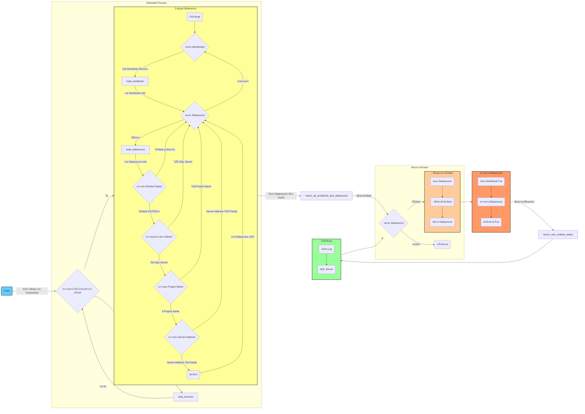

# Change Datasource Embed Status

```mermaid
graph LR;
    Start(เริ่มต้น) -->|นำเข้า Library และ Connection| Schedule
    
    subgraph Schedule Process
        Schedule{ตรวจสอบว่าเป็นวันจันทร์บ่าย 3 หรือไม่?} -->|ใช่| get_embed_datasource
        Schedule -->|ไม่ใช่| stop_process
        stop_process --> |รอเวลา| Schedule
    end

    subgraph get_embed_datasource [ดึงข้อมูล Datasource]
        start_get_embed_datasource(เริ่มดึงข้อมูล) --> f{วนอ่าน Workbooks}
        f --> |ยังมี Workbook ที่ต้องอ่าน| read_workbook
        read_workbook --> |อ่าน Workbook Info| e{วนอ่าน Datasource}
        read_datasource --> |อ่าน Datasource Info| a{ตรวจสอบ Embed Status}

        e --> |อ่านครบแล้ว| f
        e --> |ยังไม่ครบ| read_datasource

        a --> |Embed ถูกตั้งค่าแล้ว| e
        a --> |Embed ยังไม่ได้ตั้งค่า| b{ตรวจสอบประเภทการเชื่อมต่อ}
        
        b -->|ไม่ใช่ SQL Server| e
        b -->|เป็น SQL Server| c{ตรวจสอบ Project Name}

        c --> |ไม่มี Project Name| e
        c --> |มี Project Name| d{ตรวจสอบ Server Address}

        d --> |Server Address ไม่ใช่ Panda| e
        d --> |Server Address เป็น Panda| save_workbook_and_datasource_id(บันทึกค่า)

        save_workbook_and_datasource_id -->|อ่าน Datasource ถัดไป| e
    end

    subgraph loop_update_connection [อัปเดตการเชื่อมต่อ]
        g{วนอ่าน Datasource} -->|ยังไม่ครบ| change_embed_status
        g -->|ครบแล้ว| end_program(จบโปรแกรม)
    end

    subgraph change_embed_status [เปลี่ยนสถานะ Embed]
        search_datasource(ค้นหา Datasource) --> change_embed_password(เปลี่ยนรหัส Embed)
        change_embed_password --> update_datasource(อัปเดต Datasource)
    end

    subgraph check_datasource [ตรวจสอบ Datasource]
        search_workbook_for_check(ค้นหา Workbook ใหม่) --> search_datasource_for_check(ตรวจสอบ Datasource)
        search_datasource_for_check --> save_new_embed_status(บันทึกสถานะใหม่)
    end

    subgraph insert_data [บันทึกข้อมูล]
        send_log(บันทึก Log) --> sqlserver(SQL Server)
    end

    get_embed_datasource --> |คืนค่า Datasource ที่ตรงเงื่อนไข| return_all_workbook_and_datasource

    check_datasource --> |คืนค่าการเปลี่ยนแปลง| return_new_embed_status
    return_all_workbook_and_datasource --> |อัปเดต Embed| g
    change_embed_status --> check_datasource
    return_new_embed_status --> insert_data
    insert_data --> g

    style Start fill:#66ccff,stroke:#333,stroke-width:2px;
    style get_embed_datasource fill:#ffff99,stroke:#333,stroke-width:2px;
    style change_embed_status fill:#ffcc99,stroke:#333,stroke-width:2px;
    style check_datasource fill:#ff9966,stroke:#333,stroke-width:2px;
    style insert_data fill:#99ff99,stroke:#333,stroke-width:2px;

```
